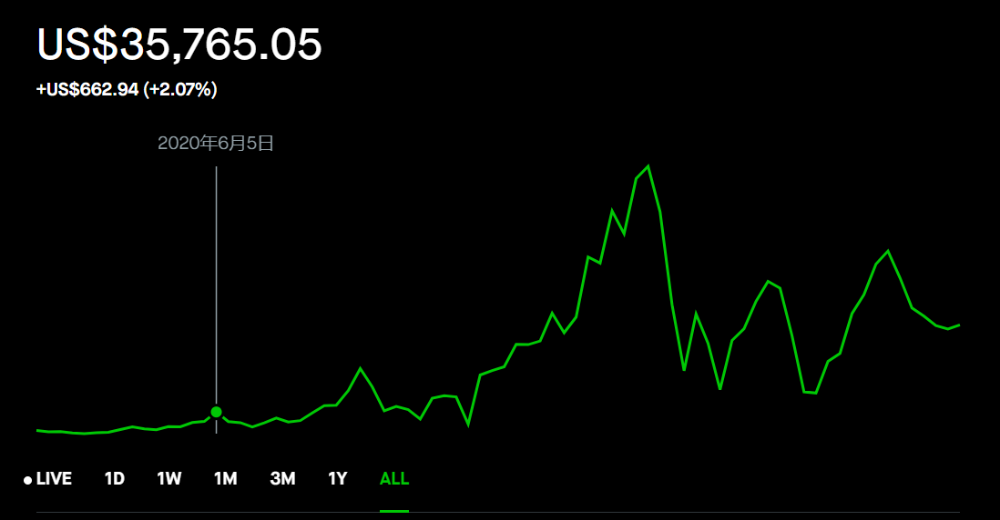
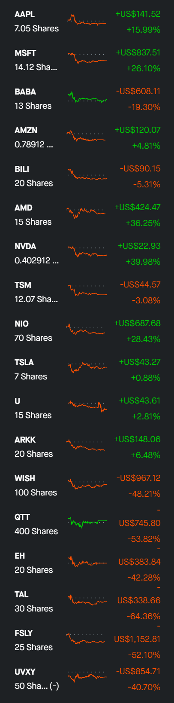

# Stock Market Thing (我的股市思考)

## Intro

- Why

The reason I write this note is to tracking my thought through the stock market. After one and a half year of experience in stock market, I found that my though is still influenced by other's opinion and not consist most of time, so I write down this note to remind me my opinion, reduce impulse buying and come back to it to see if it is make sense.

I will list some [to-do](#To-Do-List) for me in the comming months

I also note down [what I though daily](#Trading-History) with market performance

炒股目标： 一年内Robinhood资产增加50%

- My total return (2021/08/10)

- My updated Profolio (2021/08/10)

## To Do List

* 持续关注基建股 IFRA@[34-36]
* 遇到反弹减仓中概股，不再加仓中概股
    * NIO -20@[50-55]
    * BILI -10@[95-100]
    * BABA -10@[250] 期权250 call 6-8 止盈
* 持续卖WISH Call 收回本金,时机合理卖出 （达到盈利）
* 纳斯达克指数补仓位置 [14330-14340] 回调5%,[13810-13820] 回调8%   QQQ [348-350], [335-337]

## Trading History
----
2021/08/10

大盘道琼斯指创历史新高， 标普不动，纳指少量下跌
工业持续复苏，前两日缩水基建计划通过后的持续利好

今日我的股票小跌，主要持仓是科技股的原因，正常，持续观望

之前20买入TAL，举动不谨慎+运气差+希望投机，买入同时要做好计划，设定止损。不要随意左侧补仓，不许不设止损

买入UVXY40share@27, 目前亏损，目前设定24止损， 买入前观望一个月，UVXY在27-30间震荡，希望低点买入小幅获利并应对可能到来的大跌，买入后就破新低，服气。

关注纳指走势，有走弱苗头

---
2021/08/11

UVXY按计划止损离场，波动太难了，以后少碰，做空改做SQQQ.

---
