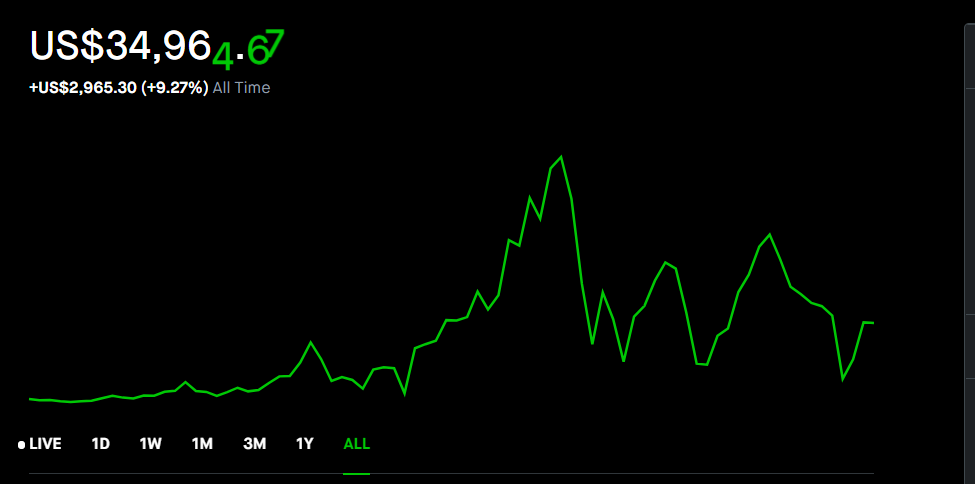

# Stock Market Thing (我的股市思考)

## Intro

- Why

The reason I write this note is to tracking my thought through the stock market. After one and a half year of experience in stock market, I found that my though is still influenced by other's opinion and not consist most of time, so I write down this note to remind me my opinion, reduce impulse buying and come back to it to see if it is make sense.

I will list some [to-do](#To-Do-List) for me in the comming months

I will list my [estimate value](#Estimate-Value) for popular stocks

I also note down [what I though daily](#Trading-History) with market performance

炒股目标： 一年内Robinhood资产增加50%

- My total return (2021/08/10)

- My updated Profolio (2021/08/10)

## To Do List

* 持续关注基建股 IFRA@[34-36]
* 遇到反弹减仓中概股，不再加仓中概股
    * NIO -20@[50-55]
    * BILI -10@[95-100]
    * BABA -10@[250] 期权250 call 6-8 止盈
    * TAL, EH, QTT 被套，等着吧
* 持续卖WISH Call 收回本金
* 纳斯达克指数补仓位置 [14330-14340] 回调5%,[13810-13820] 回调8%   QQQ [348-350], [335-337]

## Estimate Value

|\# |Stock |Ticker | Value (next quarter) | Support | Reason | My Join Price| My Target Price |
|---|----|---|---|---|---|---|----|
|| Nasdak | .Nas | 
|| Airbnb| ABNB |   | [129-138], [140-142], [152-157] | |
|| Apple| AAPL |   | [120-137],  | |
|| ASML Holding| ASML | | [700-710], [664-691], [614-652] || [634-650]@%2, [586-593]@%4| 
|| Disney| DIS | | [183-190], [167-168], [144-154] | |
|| Micron | MU | | [70-74.5], [60-64] |
|| Palantir| PLTR | [26-31] | [21-22], [17.9-20.1], [15-16] | |

## Trading History
----
2021/08/10

大盘道琼斯指创历史新高， 标普不动，纳指少量下跌
工业持续复苏，前两日缩水基建计划通过后的持续利好

今日我的股票小跌，主要持仓是科技股的原因，正常，持续观望

之前20买入TAL，举动不谨慎+运气差+希望投机，买入同时要做好计划，设定止损。不要随意左侧补仓，不许不设止损

买入UVXY40share@27, 目前亏损，目前设定24止损， 买入前观望一个月，UVXY在27-30间震荡，希望低点买入小幅获利并应对可能到来的大跌，买入后就破新低，服气。

关注纳指走势，有走弱苗头

---
2021/08/11

UVXY 打到止损退出，之后少碰波动指数，做空考虑SQQQ

一日基本持平，持仓NIO，U出财报，继续持仓。

---

2021/08/12

整体大盘继续走高，但是交易量一直降低，等待未来可能会有的大动作。经济复苏股，科技股都在走高，我的持仓在走低，主要中概股 BABA, BILI, NIO, 感觉今年都难以回暖。

Wish出财报，跌回最低点@7.5，回本遥遥无期

MRNA 这几个月涨了好几倍，看得十分眼红，但是不熟悉医疗领域，还是不要入场了

---

2021/08/13

成长股继续承压，我的持仓继续亏损，BABA跌倒支撑位186-187， 没忍住又买了2022CALL@250

成长股抄底要注意，只有到支撑才抄底，另外注意分段抄底，将资金分为3份1,2,2，第二份要贪，第三份要以防万一

买卖股票不要急，要看长远

---