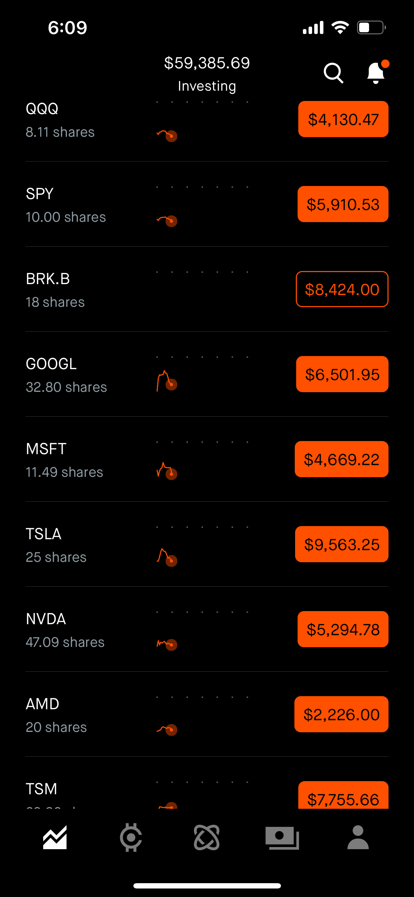
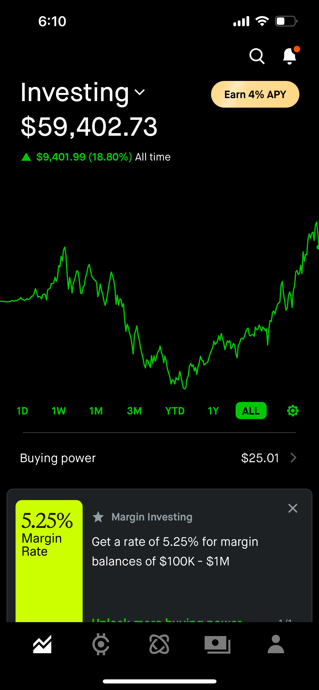

# Stock Market Trading Daily (我的股票交易日记)

## Intro

- Why

The reason I write this note is to tracking my thought through the stock market. After one and a half year of experience in stock market, I found that my though is still influenced by other's opinion and not consist most of time, so I write down this note to remind me my opinion, reduce impulse buying and come back to it to see if it is make sense.

I will list some [to-do](#To-Do-List) for me in the comming months

I will list my [estimate value](#Estimate-Value) for popular stocks

I will list some [strategy note](#Note) for me to study and understand my invest strategy 

I also note down [what I though daily](#Trading-History) with market performance

炒股目标： 一年内(2026/01)Robinhood资产增加33%， target 80k

- My total return (2025/02/02)

- My updated Profolio (2025/02/02)

## Note
* Nasdaq 100 / QQQ = 40.9
* S&P 500 / SPY = 10

## To Do List

* 标普指数补仓位置 SPY [580] 回调5%,[540] 回调8%  
* 

## Estimate Value

|\# |Stock |Ticker | Value (next quarter) | Support | Reason | My Join Price| My Target Price |
|---|----|---|---|---|---|---|----|
|| Nasdak | .NDX | |[15844-15854], [14330-14340],[13810-13820]||
|| S&P 500 | .SPX | | [4555-4565], [4445-4455], [4355-4360], ||
|| Dow Jones | .DJI | | [35432-35442] ,[34730-34735], [34172-34177] ||
|| AMD | AMD | [97-112] | [112-113], [108.4-110], [102.7-106] | |
|| Apple| AAPL | [138-158]  | [122-127],[129-132.5],[133.6-137.2], [144.5-150.6]  | | [141]2% , [135-136]2%,[120-125]4%
|| ASML Holding| ASML | | [700-710], [664-691], [614-652] ||  
|| Disney| DIS | | [183-190], [167-168], [144-154] | |
||Meta| FB | [356-399]| [348-355], [341-344], [321-336],[311-319],[253-287] | |  [312]2%
|| Google| GOOG |[2859-3136] | [2572-2625], [2495-2549], [2398-2449] | |
|| Intuitive Surgery| ISRG | | [1044-1057], [950-978], [902-922],[880-891git] | | [832-860]2%
|| Navdia| NVDA | [294-300], [245-265], [216-230], [189-213] | [172.6-180.2], [162.7-163] | | [246-265]2%
|| Taiwan Semi| TSM | | [103-106], [96-101], [87-90] | | [108]2%
|| Tesla| TSLA | [781-932] | [841-876] ,[784-816], [726-759], [646-702], [560-630] | | [780]5% [820]2% [860]1%
|| Walmart| WMT | [143-147], [139.5-142.8] | [135.7-138.4], [128-134] | | [132]2%

## Note
- [复盘计划](#复盘计划)
- [我的投资战略](#我的投资战略)
- [投资账户](#投资账户)

### 复盘计划

复盘为了总结每日得失，重点是
1. 看经济新闻，了解时政热点
2. 看大盘，全球指数，美元指数
3. 看板块变化
4. 看个股变化
    * 板块内涨跌前十
    * 关注的股票
    * 持仓股
        * 结构，技术面， 新闻。基本面
5. 更新交易计划，做笔记

### 我的投资战略
1. 如果对公司技术/前景有顾虑/不看好,绝对不投资
2. 如果觉得公司不道德/不符合我的观念，绝对不投资
3. 投资坚持左侧交易，投资之前先确定要加的所以仓位，然后分配为 20%，30%， 50%， 在建仓时就要确认需要买入多少。
    1. 20% 在第一个支撑/关键点， 在70%概率能盈利的地方（自己估计）
    2. 30% 在第二个关键点， 在90%概率盈利的地方
    3. 50% 在 110%概率盈利的地方（基本达不到的地方）
    4. 基本面发生变化，需要时果断离场（难）
4. 每次买入的同时要必须设定止损位置（对于中期投资，长期投资思考什么情况会止损离场）
5. 冲动买入/怕低价失去赶紧买不可取，我做的是中/长期投资
6. 要经常关注股票，但买入一定要少，这个很难，还在学习，巴菲特说过，如果一生只能买入三次股票，人们都会赚钱，学习这种方法。

每次买入前要check投资战略

### 投资账户
1. *Roobinhood*
- **进行长期投资**
- 买入大盘指数
- 不买入短期要卖出的股票
- 做一些期权
2. *Vanduard*
- 长短期股票都买
- 可以买一些小/未来投机股票
3. *Wealthfront*
- 定期投钱
- 不管

## Trading History

2025/02/02
好久没记录了，重新开始记录最近的动态， 目前SPY（6000）， QQQ（509）
1.AI 热潮，科技股继续疯涨，半导体和AI科技股，在还没有将AI变现之时已经涨了很多，虽然有估值过高的嫌疑，我还是看好GOOG，MSFT，NVDA等科技芯片股，
2.Trump从今年年初开始上台，从去年11月份当选之后，进一步促进股票上涨，上台后颁布一些不利于贸易全球化的政策，估计股票短期回调，长期看好上涨
3.寻找下一个热点，之前炒作量子计算机，不太成功，看好机器人？

---
2024/04/28
今年年初到现在股票一直涨，涨到SPY（5070），QQQ（431），之前的看法完全错误，股票到现在总该跌了吧，我能减到仓位其实不多了，Vangard可以减一些，Robinbood可以卖一些垃圾股。
还是相同看法 目标加仓GOOGL（171 现在较高），SPY，MSFT（406 ），BRKB（402 避险资产），NVDA（），QQQ
TSLA是年轻人喜欢的，可以长持， 可是TESLA最近跌跌很多，现在到168，最低142，还没想好是不是要加仓，可以120-140加一些？这么思考：如果不确定要不要加仓，就不加，或者到没法拒绝的低位再加仓。

---
2023/12/23
股票一直涨到圣诞前，SPY（4730），QQQ（407），听说未来几天还会继续涨，考虑明年年初减仓？Vanguard可以现在就减仓了，

---
2023/12/14
股票还在一直涨，到现在SPY（4700），QQQ（405）都达到前高了，看不懂，从上次仓位一直没有变化，等待减仓。Robinhood 仓位80%， Vanguard 57%，Fidelity 75%，Vanguard 和 Robinhood减仓， Fidelity可以考虑右侧，只买不卖
大权重股最近涨了一些，其他也在涨
中钙之前考虑70-73接盘BABA，贪69一直没有接到，

---
2023/11/17
最近股票又涨了一波，SPY到达4500，不是很理解，也觉得差不多了，逐渐减仓，最近Xi来SF参加APEC，以为中美关系缓和中钙会涨，发现并没有，甚至跌了，可以考虑70-73解盘BABA，NIO就逢高期权出了吧，
FEDELITY还有15k cash，准备买大盘吧
MSFT fire openai ceo，不是什么正直的事情
思考：预期 vs 实际

2023/11/08
股市现在不高不低，加息接近尾声，依然维持高利率，加息触顶所以股票涨，未来看跌，再涨的话陆续出股票，SPY在4000-4100接盘，底线 3800
MSFT比较高，减一些
目标加仓GOOGL，SPY，MSFT，BRKB，NVDA，QQQ
TSLA是年轻人喜欢的，可以长持

2023/08/29
股市现在在高点

----
2021/08/10

大盘道琼斯指创历史新高， 标普不动，纳指少量下跌
工业持续复苏，前两日缩水基建计划通过后的持续利好

今日我的股票小跌，主要持仓是科技股的原因，正常，持续观望

之前20买入TAL，举动不谨慎+运气差+希望投机，买入同时要做好计划，设定止损。不要随意左侧补仓，不许不设止损

买入UVXY40share@27, 目前亏损，目前设定24止损， 买入前观望一个月，UVXY在27-30间震荡，希望低点买入小幅获利并应对可能到来的大跌，买入后就破新低，服气。

关注纳指走势，有走弱苗头

---
2021/08/11

UVXY 打到止损退出，之后少碰波动指数，做空考虑SQQQ **2021/10/01 现在来看做空有的赚**

一日基本持平，持仓NIO，U出财报，继续持仓。

---

2021/08/12

整体大盘继续走高，但是交易量一直降低，等待未来可能会有的大动作。经济复苏股，科技股都在走高，我的持仓在走低，主要中概股 BABA, BILI, NIO, 感觉今年都难以回暖。

Wish出财报，跌回最低点@7.5，回本遥遥无期

MRNA 这几个月涨了好几倍，看得十分眼红，但是不熟悉医疗领域，还是不要入场了

---

2021/08/13

成长股继续承压，我的持仓继续亏损，BABA跌倒支撑位186-187， 没忍住又买了2022CALL@250

成长股抄底要注意，只有到支撑才抄底，另外注意分段抄底，将资金分为3份1,2,2，第二份要贪，第三份要以防万一

买卖股票不要急，要看长远

---

2021/08/18

没操作，昨天跌过今天拉升尾盘又抛售，继续看戏

---

2021/08/20

---
2021/08/25

最近对市场关注度不是很高

因对美联储收紧资金流动性预期变晚，市场持续上涨，指数屡创新高。

持仓中概股持续亏损，昨日出现触底形象，不知后市如何 **2021/10/01 一大波行情，现在依然在下跌**

---
2021/09/02

关注股市不多，最近大盘一直增长，也不知加仓什么股票，美联储继续放水，到年底利率应该比较稳定

---

2021/09/07

劳动节后首日，市场比较平淡，特斯拉上涨，卖了少量，买入FED,波段持有

---

2021/09/08

大盘小回调

**2021/10/01 现在回想，是什么原因在股市上涨的时候想不到减仓，贪婪？如果有明确的规划，炒股变成纯粹数学问题，是不是可以简单一些？**

---

2021/09/20               

四巫日回来的周一，全球股市震荡，
美股各指数跌超2%
很多股票达到买入位，陆续加仓： \
FDX 254 3% \
BRK.B 278 2% \
CAT 190.81 2% 

未来关注加仓： \
ADP 249 2% \
NVDA 203 2%  \
CAT 173 2% \
V 217 3%

---

2021/09/21

大盘继昨日暴跌后，今天有所缓和，没有继续下跌，开盘拉升之后又下跌，收盘在昨日收盘点数。感觉多空拉锯，等明日的美联储决议

---

2021/09/22

美联储讲话，大盘回暖
FDX 财报暴雷，之前加仓仓位过多，下跌后没有仓位了，再次体会到了控制仓位/有耐心的重要性

---

2021/09/30

一周美股持续走跌，向120日均线下探，关注不是很多，加仓少量指数。

---

2021/10/01

今日各大指数反弹，是触底走势，不知下周情况，未来要到Q4财报季，又是一波预期财报行情。物流持续恶化，国债指数走高，大环境上未来成长股看来要持续承压，短期买入价值股

---

2021/10/07

一周没怎么关注市场，这周波动挺大的，先跌，也没有什么具体原因，政府停摆，通胀，国债走高，还是之前的炒作内容。

周一周二股市走低，周三周四走高，看周五的大非农数据

---

2021/10/13

近日市场波动减小，中概股有小抬头，美股大盘持续震荡，财报季来临，本周金融股票出财报，财报表现平平，通胀继续增长，大部分分析缩债从今年11月陆续开始

---

2021/10/15

市场持续走高，回补之前缺口，未来还是继续看涨，今天TESLA突破850

---

2021/10/18

纳指/科技股走高，减仓部分TSLA,等回撤800-810再加仓

---

2021/10/19

财报季开始了，科技股持续走高，中概股也开始反弹，BABA有芯片相关利好。大方面上看时机持续减仓，BILI上看85减仓部分，NIO上看50减仓（看财报表现）

---

2021/10/20

股市有点涨不动了，大盘微跌，小盘股开始继续涨，继续看财报，对于中概股和超估值股票看机会减仓，

---

2021/10/27

本周两天TSLA走势很好，周一科技股强势上涨，周二上涨乏力，财报季股票波动都与财报挂钩

周二Vanguard账户自动买入Visa@217,价格还可以，等待经济复苏旅游业带动上涨。

目前计划：长迟大科技，拉低中小盘看好的成长股成本，减仓中概和之前跟风买入的股票

---

2021/10/28

Facebook 改名为Meta, Amazon,Apple 出财报，都不及预期，股市整体依然上涨，中小盘强劲，我的WISH,FASTLY 还是半死不活。。光卖call也不是个事，找机会都出了吧。

Amazon近期预期不好，找机会出了，换成Apple

---

2021/11/10

最近没有怎么更新，但是股票还在持续关注，特斯拉大涨到1100，继续持有不动，今天有点见顶回落，我的部分利润回吐

*最近元宇宙股票涨势很好，之前持有的NVDA, AMD, U 都涨了很多，思考自己当时出在了山腰，找时机卖股票真的很难，还是要长持为主，不随意卖股票，卖出只有在股票不行的时候，长持中卖CALL套利，往高了卖。*

---

2021/11/12

本周最后一个交易日，股票波动不大，之前新IPO的公司Rivian新买入就获得了30%的收益，可惜买少了，之后考虑在风险控制的同时加大投入？

---

2021/11/15

又是新一周，股市比较平静，今晚中美谈话，不知明天中概股会不会走高

---

2021/11/30

近期新变异病毒，美国taper加速，股票波动比较大，个股下跌不少，昨天加仓了 JP Morgen, 今日无变化，之前低位加仓股票近期回调，利润基本都吐出来了，但是滚动减仓点真是不好找，还需学习